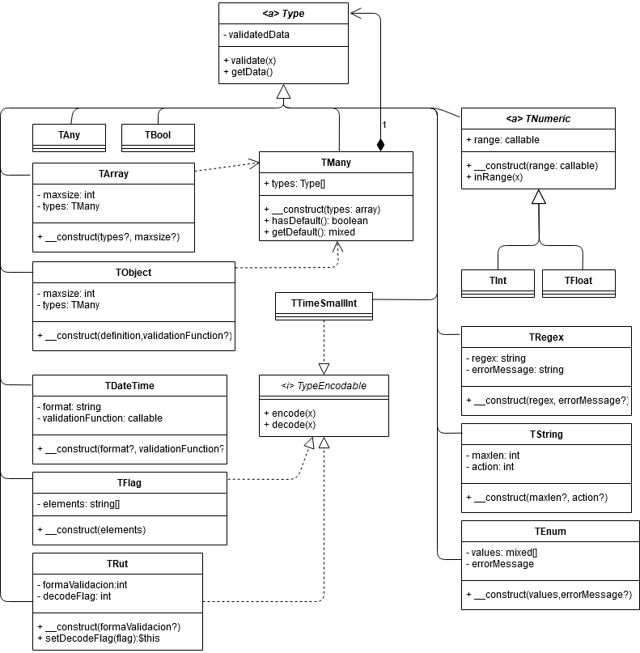

[TOC]

# Introducción 

`Type` Es un espacio de nombres de clases validadoras de tipos de datos. Si un dato no cumple se lanza una `TypeException`. 

## Uso básico

```php
// Importar el autoload de Type
require_once '{ruta}/Type/autoload.php';

// Se recomienda importar las clases del namespace 
// antes de usarlos
use Type\TString; 

// declaración de un validador de string
$paramString = new TString( 4 );
$paramString
  ->validate( 123 );          // Lanza exepción

$paramString
  ->validate( "Hola mundo" )  // no lanza excepción
  ->getData();                // "Hola"  
```

## Diagrama de clases



## `abstract` `class` Type

Verifica la validez de un tipo y parsea de ser necesario.

```php
abstract class Type{
  // El valor validado
  protected $validatedData;

  /**
   * Función de validación.
   * Si $x es válido o puede ser parseado
   * $validatedData debe tomar el valor de $x;
   * @return $this
   * @throws TypeException en caso de no validación
   */
  abstract function validate($x);

  /**
   * @return $validatedData. Aunque primero debe ser validado
   */
  function getData($x);
}
```

# Tipos Simples

## `class` TAny

Valida cualquier valor y no lanza excepción.

```php
$param = new TAny;
$param->validate(4);     // ✅ validado y sin excepciones
$param->validate("foo"); // ✅ validado y sin excepciones
$param->validate([4]);   // ✅ validado y sin excepciones
```

## `class` TBool

El valor a validar debe ser un *equivalente* a un booleano. Cualquier otro valor distinto a los de abajo lanza una `TypeException('NO_BOOL')`

```php
$param = new TBool;
$param->validate(0)->getData();       // ✅ false
$param->validate(false)->getData();   // ✅ false
$param->validate('false')->getData(); // ✅ false
$param->validate(1)->getData();       // ✅ true
$param->validate(true)->getData();    // ✅ true
$param->validate('true')->getData();  // ✅ true
```

## `class` TDateTime

Valida una fecha o una hora con formato. Si no se asigna formato asume `Y-m-d`. Para formatos puedes visitar la documentación de la clase [DateTime](https://www.php.net/manual/es/class.datetime).

```php
/**
  * @param formato el formato de DateTime
  * @param rango funcion($x) de validación de rango.
 */
$param = new TDateTime($formato = 'Y-m-d', $rango = null);

// Ejemplo simple
$param = new TDateTime;
$param->validate("2020-20-10"); // ❌ INVALID_DATE
$param->validate("2021-02-30"); // ❌ INVALID_DATE
$param->validate("2020/01/10"); // ❌ INVALID_DATE_FORMAT
$param->validate("2020-05-10"); // ✅ validado

// Ejemplo con función de rango
$param = new TDateTime('H:i:s',function($x){
  return ($x >= '10:00:00' && $x < '15:30:00');
});

$param->validate("12:00:00"); // ✅ validado
$param->validate("15:59:00"); // ❌ DATETIME_NOT_IN_RANGE
```

## `class` TEnum

Valida que un elemento esté dentro de un conjunto finito de valores primitvos posibles.

```php
$params = new TEnum(array $valores, string $errorMessage = 'NO_ENUM');

//Ejemplo
$params = new TEnum(['rojo','verde','azul'], 'NO_COLORES');

$params->validate("hola mundo"); // ❌ NO_COLORES
$params->validate("rojo");       // ✅ validado
```

## `abstract` `class` TNumeric

Verifica que un valor sea numérico y esté en un rango. 

```php
abstract class TNumeric{
  // function($x) rango del valor numérico.
  protected $rango; 
  function __construct($rango = null);

  /**
   * Function de validación de rango
   */
  function inRange($x);
}
```

## `class` TInt

```php
class TInt extends TNumeric;
```

Valida un valor entero.

```php
$param = new TInt;
$param->validate(3)->getData();     // ✅ 3
$param->validate("3")->getData();   // ✅ 3
$param->validate(3.5)->getData();   // ✅ 3
$param->validate("3.5")->getData(); // ✅ 3
$param->validate("foo")->getData(); // ❌ NO_INT

$param = new TInt(function($x){return $x > 0;});
$param->validate( 3)->getData();    // ✅ 3
$param->validate(-3)->getData();    // ❌ INT_NOT_IN_RANGE
``` 

## `class` TFloat

```php
class TFloat extends TNumeric;
```

Valida un valor flotante

```php
$param = new TFloat;
$param->validate(3)->getData();     // ✅ 3
$param->validate("3")->getData();   // ✅ 3
$param->validate(3.5)->getData();   // ✅ 3.5
$param->validate("3.5")->getData(); // ✅ 3.5
$param->validate("foo")->getData(); // ❌ NO_FLOAT

$param = new TFloat(function($x){return $x > 0;});
$param->validate( 3)->getData();    // ✅ 3
$param->validate(-3)->getData();    // ❌ FLOAT_NOT_IN_RANGE
``` 

## `class` TRegex

Valida que un elemento encaje con una expresión regular.

```php
$tarjetaCredito = '/(?:\d{4}-){3}\d{4}/';
$param = new TRegex($tarjetaCredito);

$param->validate("1234-5678-9999-9999"); // ✅ validado
$param->getData(); // [ 0 => "1234-5678-9999-9999" ]

$param->validate("1999-"); // ❌ INVALID_REGEX
```

`TRegex` puede lanzar errores personalizados.

```php
$emailRegex = '/.+@.+\..+/';
$param = new TRegex($emailRegex,'INVALID_EMAIL');

$param->validate("john@doe.com"); // ✅ validado
$param->getData(); // [ 0 => "john@doe.com" ]

$param->validate("john@doe"); // ❌ INVALID_EMAIL
```

## `class` TString

Valida un string de tamaño fijo o indefinido. Por defecto, si un string supera el máximo lo recorta pero puede lanzar error si se desea.

```php
$param = new TString;
$param->validate(45);      // ❌ NO_STRING
$param->validate("hola");  // ✅ validado

//$param = new TString(5, TString::CUT);
$param = new TString(5);  
$param->validate("algún string largo"); // ✅ validado
$param->getData(); // "algún"

$param = new TString(5,TString::ERROR);
$param->validate("algún string largo"); // ❌ STRING_MAX_LEN.5
```

# Tipos Compuestos

## `class` TArray

Valida que el valor ingresado sea un array de cualquiera o algunos tipos. Para soportar multiples valores usa implícitamente [TMany](#markdown-header-class-tmany)

```php
// valida cualquier array
$param = new TArray;     
$param->validate(4);        // ❌ Lanza NO_ARRAY
$param->validate(["foo"]);  // ✅ validado
$param->validate([5,6]);    // ✅ validado
$param->validate([4,[45]]); // ✅ validado

// valida array de enteros
$param = new TArray( new TInt );
$param->validate(4);         // ❌ NO_ARRAY
$param->validate(["foo"]);   // ❌ NO_INT:0
$param->validate([5,6]);     // ✅ validado
$param->validate([5,"bar"]); // ❌ NO_INT:1
$param->validate([4,[45]]);  // ❌ NO_INT:1

// Valida Array de Strings o números
$param = new TArray( [ new TString, new TInt ] );
$param->validate(4);         // ❌ NO_ARRAY
$param->validate(["foo"]);   // ✅ validado
$param->validate([5,6]);     // ✅ validado
$param->validate([5,"bar"]); // ✅ validado
$param->validate([4,[45]]);  // ❌ NO_INT:1

// Ejemplo de recursividad.
// Valida un array que contenga strings o arrays de enteros 
$param =  new TArray([ new TString, new TArray( new TInt ) ]);
$param->validate([  "abc" ,  "def"  ]); // ✅ validado
$param->validate([  "abc" , ["def"] ]); // ❌ NO_INT:0:1
$param->validate([  "abc" , [1,2,3] ]); // ✅ validado
$param->validate([ [0,5,8], [1,2,3] ]); // ✅ validado
```

## `class` TMany
Valida un array de tipos o valores posibles. No es necesario usarlo en `TObject` o `TArray` puesto que es implícito.

```php
//Si hay objetos `Type` y no encuentra un tipo validado, lanza como error el último error encontrado.
$param = new TMany([new TInt, new TString, false ]);
$param->validate(12);     // ✅ validado
$param->validate("hola"); // ✅ validado
$param->validate(false);  // ✅ validado
$param->validate(null);   // ❌ NO_BOOL

// Si no hay objetos `Type` se puede usar como validador de valores posibles 
$param = new TMany([ "a", "b", 5 ]);
$param->validate("a");    // ✅ validado
$param->validate(null);   // ❌ INVALID_VALUE
```

## `class` TObject

Valida una estructura de objeto. Es el tipo más versátil de todos.

### Uso típico

En el siguiente ejemplo, un objeto con un `id` y un `name` de máximo 6 caracteres.

```php
$params = new TObject([
  "id"   => new TInt,
  "name" => new TString(6)
]);

// ❌ NO_OBJECT
$params->validate(4); 

// ❌ NO_KEY.name
$params->validate([ "id" => 5 ]); 

// ❌ NO_INT:id
$params->validate([ 
  "id"   => "hola",
  "name" => "mundo"
]);´

// ✅ validado
$params->validate([ 
  "id"   => 8,
  "name" => "Jhon Doe"
]);

// [ 
//   "id"   => 8,
//   "name" => "Jhon D"
// ]
$params->getData();
```

### Funcion de validación grupal

`TObject` tambien tiene una función de validación personalizada que se ejecuta luego que han evaluado todos los elementos individuales. Esta no necesita retornar un valor sino que debe lanzar `TypeException` si hay una condición que no satisfaga.

```php
// la hora de inicio debe ser menor a la final
$params = new TObject([
  "inicio" => new TDateTime('H:i:s'),
  "final"  => new TDateTime('H:i:s')
],function($x){
  if( $x['inicio'] > $x['final'])
    throw new TypeException('HORAS_INVERTIDAS');
});
```

### Multiples tipos y valores por defecto 

`TObject` acepta valores por defecto en caso que un valor no sea ingresado. Como también acepta múltiples tipos de valores. Para soportar multiples valores usa [TMany](#markdown-header-class-tmany)

⚡ **CUIDADO** ⚡ si dentro de un parámetro escribes valores primitivos y el cliente no envía el parámetro asumirá el primer valor como por defecto. Si quieres restringir valores primitivos, mejor usa [TEnum](#markdown-header-class-tenum)

```php
$params = new TObject([
  "valorA" => [ new TString, null ],
  "valorB" => [ new TInt, new TString]
]);

// LO de arriba es equivalente a colocar
$params = new TObject([
  "valorA" => new TMany([ new TString, null ]),
  "valorB" => new TMany([ new TInt, new TString])
]);

// [
//  "valorA" => null,
//  "valorB" => 5
// ]
$params->validate([ "valorB" => 5 ])->getData(); 
```

### Tipos condicionales

`TObject` acepta funciones como valor para sus claves. Esto es, puedes condicionar la estructura de un parámetro dadas tus condiciones. su único parámetro es `&$buffer` que es el buffer de parámetros que ya ha validado 

⚡ **CUIDADO** ⚡ Para usar valores del buffer es necesario declararlos antes de poder llamarlos en la función. 

✅ **Correcto**

```php
$params = new TObject([
  "tipo"   => new TEnum([ "int", "string" ]),
  "params" => function( &$buffer ){
    if($buffer['tipo'] === "int" )
      return new TInt;
    else
      return new TString;
  }
]);
```

🛑 **Incorrecto**. Aparecerá un mensaje como el siguiente cuando intentes validar:

> <b>Notice</b>:  Undefined index: tipo in <b>{ruta}</b> on line <b>{line}</b><br />
  
```php
$params = new TObject([
  "params" => function( &$buffer ){
    if($buffer['tipo'] === "int" )
      return new TInt;
    else
      return new TString;
  },
  "tipo"   => new TEnum([ "int", "string" ])
]);
```

⚡ **CUIDADO** ⚡ El buffer desconoce datos fuera del contexto de `TObject`

🛑 **Incorrecto**. El segundo nivel desconoce a `foo`.

> <b>Notice</b>:  Undefined index: foo in <b>{ruta}</b> on line <b>{line}</b><br />
  
```php
$params = new TObject([ // primer nivel
  "foo" => new TInt,
  "bar" => new TObject([ // segundo nivel
    "baz" => function( &$buffer){
      if( $buffer["foo"] > 0 )
        return new TString;
      else
        return new TArray( new TInt );
    }
  ])
]);
```

## `class` TRecursive

`TRecursive` Es un tipo especial que permite estructurar de manera recursiva. Solo acepta `TArray` o `TObject` para su estructura.

```php
$tree = new TRecursive;
$tree->setStruct( new TObject([
  "name" => new TString(5),
  "children" => [ [], new TArray( $tree ) ]
]));
```

# Subconjuntos

En alugnos casos es necesario extraer solo una parte de un validador `TObject`. 

⚡ **CUIDADO** Esta sección asume que sabes como funcionan la mayoría de validadores, usar `TObject` y `TArray`. 

✅ **GARANTÍA** `TSubObject` y `TSubArray` solo lanzan excepciones propias si están mal formados. 

```php
$schema = new TObject([
  "foo" => new TObject([
    "a" => new TInt,
    "b" => new TInt
  ]),
  "bar" => new TObject([
    "c" => new TInt,
    "d" => new TInt
  ]),
  "baz" => new TObject([
    "e" => new TString,
    "f" => new TString
  ]),
  "hey" => new TArray(new TObject([
    "g" => new TString,
    "h" => new TString,
    "i" => new TString,
    "j" => new TString,
  ])),
  "boo" => new TArray([
    new TObject([
      "x" => new TDateTime,
      "y" => new TDateTime,
      "z" => new TFloat,
    ]),
    new TString
  ])
]);
```

## `class` TSubObject

`TSubObject` Recorre la estructura de un `TObject` y permite la utilización de un subconjunto de claves. SOLO acepta `TObject` como argumento.

```php
$subSchemaA = new TSubObject($schema,$struct);

// Donde $struct puede ser

// incluye todo el validador 
// Aunque no tiene sentido usarlo directamente
$struct = true; 

// incluye solo "foo" y "bar"
$struct = "foo,bar";

// excluye "foo" y "baz",
// incluye solo "bar" y "hey" 
$struct = "!foo,baz";

// Si hay TObject anidados
$struct = [
  "foo" => true,  // incluye "foo"
  "bar" => "c,d", // incluye "c" y "d"
  "baz" => "!e,f,g"   // no incluye "e" ni "f" ni "g"
  // no incluye "hey"
];

// Si hay TArray anidado
$struct = [
  "boo" => "!z;&t" // ver TSubArray Para más detalle
];
```

## `class` TSubArray

`TSubArray` escoge algunos de los validadores de un `TArray` y si algunos de los elementos es un `TObject` lo convierte a `TSubObject`.

```php

$schema = new TArray([
  new TObject([
    "x" => new TDateTime,
    "y" => new TDateTime,
    "z" => new TFloat,
    "w" => new TObject([
      "t" => new TString
      "u" => new TString
      "v" => new TString
    ])
  ]),
  new TString,
  new TArray([new TInt,new TEnum(["a","b","c"])])
]);

$sub = new TSubArray($schema,$options);
```

Donde `$options` puede ser un string de opciones para cada
validador particular separado por punto y coma `;`.

⚡ **CUIDADO** DEBEN Haber tantas opciones como validadores dentro del `TArray`.

Valores posibles para cada opción:


|valor|significado|
|-|-|
| `"&t"` | Usar validador dentro del array |
| `"&f"` | No usar validador |
| `<string vacío>` | No usar validador |
| `<cualquier string>` | Asume opciones para `TObject` |
---

El uso de `$options` como string es limitado. Por eso, puede también ser un array indexado con los siguientes valores posibles.

|valor|significado|
|-|-|
| `true` | Usar validador dentro del array |
| `false` | No usar validador |
| `<string>` | Asume opciones para `TObject` o `TArray` según corresponda |
| `<array>`  | Asume opciones para `TObject` o `TArray` según corresponda |
---

Ejemplos de $options que pueden ser escritos como `string`:
```php
// incluye solo el validador de TString
$options = "&f;&t";
$options = [false,true];

// incluye solo el validador de TObject 
// pero sin incluir su parámetro x (ver detalles en TSubObject)
$options = "!x;&f"; 
$options = [ "!x", false];
$options = [ [ "y"=>true, "z" =>true,"w"=>true ], false];
```

Los siguientes ejemplos no puede ser representado con $options como string
```php
$options [ 
  [
    "x"=> true,
    "w"=> "t,u"
  ],
  true 
];

$options [ false, false, "&t;&f" ];
$options [ false, false, [ true, false ]];
```

# `interface` TypeEncodable
Es una interfaz cuya función es convertir de un dominio a otro y poder volver a su estado original.

```php
interface TypeEncodable{
  /**
   * Convierte un dato de entrada a otro. Si se usa en una clase hija de Type
   * debe usarse en la función de validación 
   *  
   *   $this->validatedData = self::encode($x);
   */
  function encode($x);

  /**
   * Función inversa de encode
   */
  function decode($x);
}
```

## `class` TFlag

A partir de un array de claves, el valor de entrada tomará un valor numérico. Es sensible a mayúsculas y minúsculas.

```php 
//                    1     2     4     8
$param = new TFlag(["foo","bar","baz","owo"]);
$param->validate("foo")->getData();         // ❌ NO_ARRAY
$param->validate(["foo"])->getData();       // ✅ 1
$param->validate(["foo","owo"])->getData(); // ✅ 9
$param->decode(5);                          // ["foo","baz"]
```

## `class` TRut

Reconoce patron de RUT CHILENO y lo sanitiza a sin puntos ni guión. 

```php
$param = new TRut( $forma );

// Donde 
$forma = TRut::NONE;        // NO acepta puntos ni guion.
$forma = TRut::GUION;       // Solo acepta rut con guion
$forma = TRut::PUNTO_GUION; // solo acepta rut punto-guion
$forma = TRut::FLEXIBLE;    // acepta cualquiera anterior ( por defecto )

// ✅ EJEMPLOS VALIDOS
// Teniendo en cuenta que "11.111.111-1" ES un rut válido

// TRut::FLEXIBLE y TRut::NONE 
$param->validate("111111111");     

// TRut::FLEXIBLE y TRut:;GUION 
$param->validate("11111111-1");    

// TRut::FLEXIBLE y TRut::PUNTO_GUION
$param->validate("11.111.111-1");  

// ❌ RUT_INVALIDO
$param->validate("11.111.1111");
$param->validate("11.111.111-2");
```

Se puede ajustar para obtener un rut de salida de la siguiente forma

```php
$rutEnDB = "12345789k";
$rut = new TRut;

// "12345789k"
$rut
  ->setDecodeFlag( TRut::NONE )
  ->decode( $rutEnDB );

// "12345789-k"
$rut
  ->setDecodeFlag( TRut::GUION )
  ->decode( $rutEnDB );

// "12.345.789-k"
$rut
  ->setDecodeFlag( TRut::PUNTO_GUION )
  ->decode( $rutEnDB ); 

```


## `class` TTimeSmallInt

Convierte un tiempo `HH:MM` en un número de precisión de minuto. 

```php
$param = new TTimeSmallInt;
$param->validate("10:30")->getData(); // 630
$param->validate("10:2")->getData();  // INVALID_TIME
$param->decode(630);                  // "10:30"
```

# Ejemplos

## Schema típico de un usuario

```php
$phoneRegex = new TRegex("/(?:\(\+\d{2}\))\d{8,}/","INVALID_PHONE");
$emailRegex = new TRegex("/.+@.+\..+/","INVALID_EMAIL");
$params = new TObject([
  "id"        => new TInt,
  "rut"       => new TRut,
  "name"      => new TString(20),
  "birthDate" => new TDateTime,
  "email"     => $emailRegex,
  "gender"    => [ null, "Masculino", "Femenino", "Otro" ],
  "married"   => [ new TBool, null],
  "phones"    => new TArray($phoneRegex),
  "weight"    => new TFloat
]);

```

## Recursividad de TObject y TArray. 

Dada la flexibilidad de esta librería, es posible y sin mayor esfuerzo anidar tipos compuestos.
El atributo `points` solo será válido si es un array que tenga objetos compuestos de `x` e `y`

```php
$params = new TObject([
  "name" => new TString,
  "points" => new TArray(new TObject([
    "x" => new TFloat,
    "y" => new TFloat
  ])
]);

//Ejemplo válido:
$example = [
  "name" => "Puntos"
  "points" => [
    [ "x" => 2.0 ,"y" => -1.0 ],
    [ "x" => 0.0 ,"y" =>  0.0 ],
    [ "x" => 2.0 ,"y" =>  1.1 ]
  ]
]
```

## Puntos dentro de esferas

Evalua que puntos pertenezcan a la ecuación de una esfera.

```php
function makeSphere($r,$cx,$cy,$cz){
  return new TObject([
    "x" => new TFloat,
    "y" => new TFloat,
    "z" => new TFloat
  ],
  function ($data) use ($r,$cx,$cy,$cz){
    $x = $data['x'] - $cx;
    $y = $data['y'] - $cy;
    $z = $data['z'] - $cz;
    if( $r*$r <= $x*$x + $y*$y + $z*$z)
      throw new TypeException('NO_PERTENECE_ESFERA');
  });
}

$points = new TObject([
  "a" => new TArray(makeSphere(4,0,0,0)),
  "b" => new TArray(makeSphere(1,2,0,0)),
  "c" => new TArray(makeSphere(10,-10,50,30))
]);
```

## Promoción de productos

Para un ejemplo más complejo: Una promocion es un item de nombre y precio. Tiene productos asociados y una vigencia variable. Puede ser fija o periódica. Si es fija, es necesario desde hasta cuando es válida. pero si es periódica es necesario su horario, y los días de la semana cuando se puede optar a esta promo. Es necesario tambien verifcar que el rango de horas y fechas no esté invertido.

```php
$flagDiasSemana = new TFlag(["Lun","Mar","Mie","Jue","Vie","Sab","Dom"]);
$positiveInt    = new TInt( function($x){ return $x > 0; });

define("PROMO_FIJA","fija");
define("PROMO_PERIODICA","periodica");

$promocion = new TObject([
  "item" => new TObject([
    "nombre" => new TString(20),
    "precio" => $positiveInt
  ]),
  "productos" => new TArray( new TObject([
    "id_item" => new TInt,
    "cantidad" => $positiveInt
  ])),
  "promo" => new TObject([
    "tipo" => new TEnum([ PROMO_FIJA, PROMO_PERIODICA ]),
    "spec" => function( &$buffer ){
      $dateTime = new TDateTime;

      $checkFechasInvertidas = function($x){
        if($x['desde'] > $x['hasta'])
          throw new TypeException("FECHAS_INVERTIDAS");
      }

      if ($buffer['tipo'] === PROMO_FIJA)
        return new TObject([
          "desde" => $dateTime,
          "hasta" => $dateTime
        ]);
      else 
        return new TObject([
          "horarios" => new TArray(new TObject([
            "desde"      => new TTimeSmallint,
            "hasta"      => new TTimeSmallint,
            "dias_flags" => $flagDiasSemana
          ],$checkFechasInvertidas)),
          "vigencia" => new TArray(new TObject([
            "desde" => $dateTime,
            "hasta" => $dateTime            
          ],$checkFechasInvertidas)
        ]);
    }
  ]
]);
```